# 旅游工具使用指南

## 如何添加点阵

1.    
   
   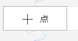
   
   点击添加点阵按钮

2.  
   
   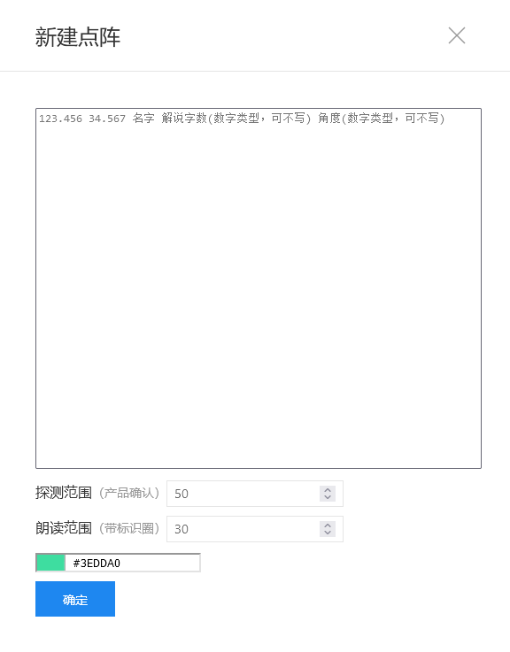
   
   按照要求，填入数据，探测范围，朗读范围，以及选择喜欢的颜色。

3. 点击确定按钮

4.  
   
   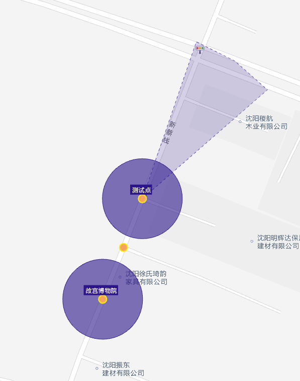
   
   此时，地图上将会显示对应的点阵。  

## 如何添加线组

1.  
   
   
   
   与添加点阵类似，输入线的数据之后，点击确定
   
   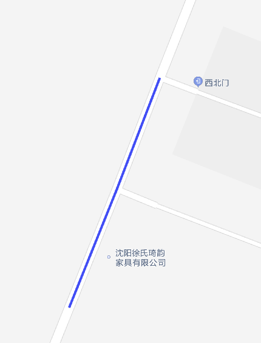
   
   

# 图层历史记录

1.  
   
   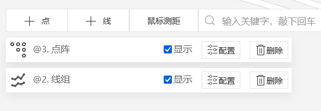
   
   在屏幕的左上角，会显示当前添加的地图图层的历史记录，左边是类型图标，点阵或者线组。然后是标题，标题是自动生成的，不支持更改。然后是一个checkbox，可以控制当前图层的显示隐藏。然后是配置项，点击之后，可以更改图层的配置。点击删除之后，会变成确定按钮，确定之后便会删除该图层。

# 鼠标测距

1.  
   
   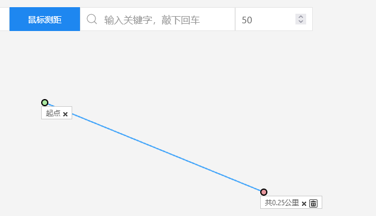
   
   点击鼠标测距之后，会进入鼠标测距模式，该模式下，点击地图可以描线进行鼠标测距

2. 再次点击鼠标测距，关闭鼠标测距模式。

# 周边搜索

1.  
   
   
   
   在输入框输入关键字，并敲击回车会发起周边检索。

2.  
   
   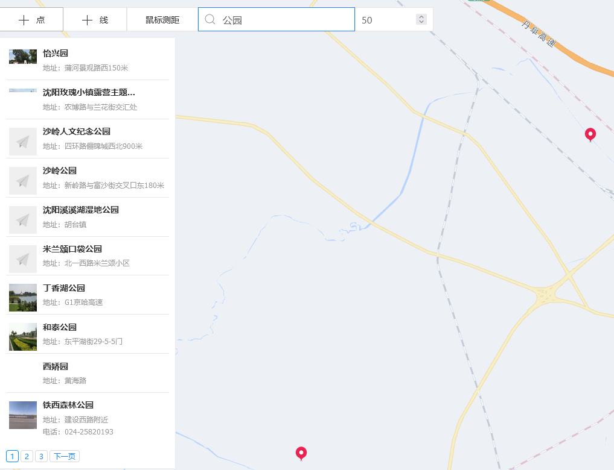
   
   默认检索范围是50公里，可以更改。

3. 删除输入框的关键字之后，左边的搜索结果页面也会消失。

# 如何发起算路

1. 在地图空白页面点击右键。
   
   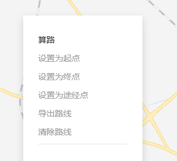
   
   会弹出右键菜单，设置起终点后，便可发起算路。

2.  
   
   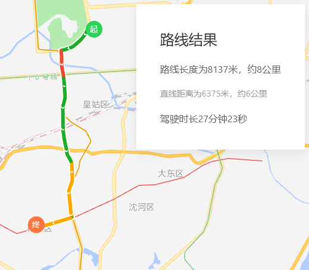
   
   算路结果信息在右上角会显示。

3. 目前的起终点和途径点，已经支持了拖动，拖动完成之后，会自动发起算路。
   
   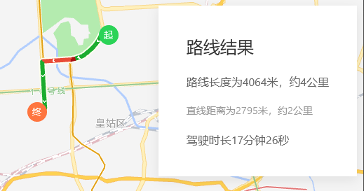

4.  
   
   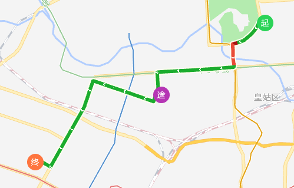
   
   起终点途径点目前均支持双击删除。

5.  
   
   
   
   目前已经支持路线的导出，导出位置为剪贴板，格式为：
   
   ```
   123.44089,41.845066
   123.44169,41.845089
   123.441781,41.84511
   ```

6.  
   
   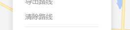
   
   点击清除路线，即可删除当前计算的路线

# 标记功能

1.  
   
   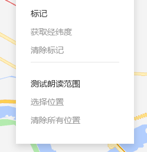
   
   标记功能，获取经纬度在地图上扎取一个点，并获取当前的经纬度，点击拷贝至粘贴板，双击删除。

2. 朗读位置标识当前的朗读范围。
   
   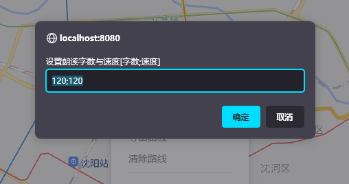
   
   点击之后，输入字数与速度，注意使用英文的分号隔开。
   
   点击确定。
   
   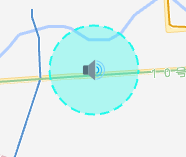
   
   地图上会标识当前的朗读范围点，双击删除。

# 图层修改

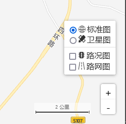

右下角的操作区域为标准的地图操作控件，这里不再赘述。

# 遇到问题？

联系开发者解决。
